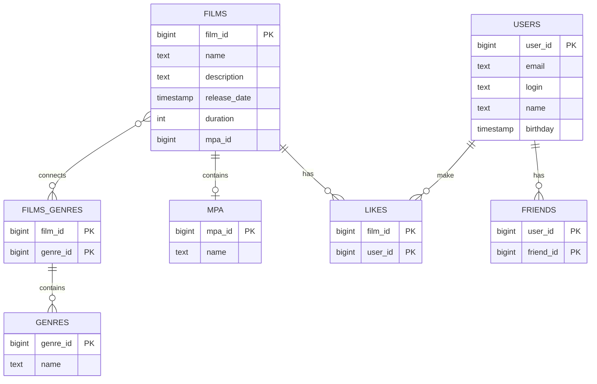

# java-filmorate
## Диаграмма базы данных

## Примеры запросов
### Получить список всех пользователей
```
SELECT 
    user_id, 
    name, 
    email, 
    login, 
    birthday
FROM 
    users;
```

### Получить список фильмов с указанием жанра
```
SELECT 
    f.film_id, 
    f.name AS film_name, 
    g.name AS genre_name
FROM 
    films f
JOIN 
    films_genres fg ON f.film_id = fg.film_id
JOIN 
    genres g ON fg.genre_id = g.genre_id;
```
